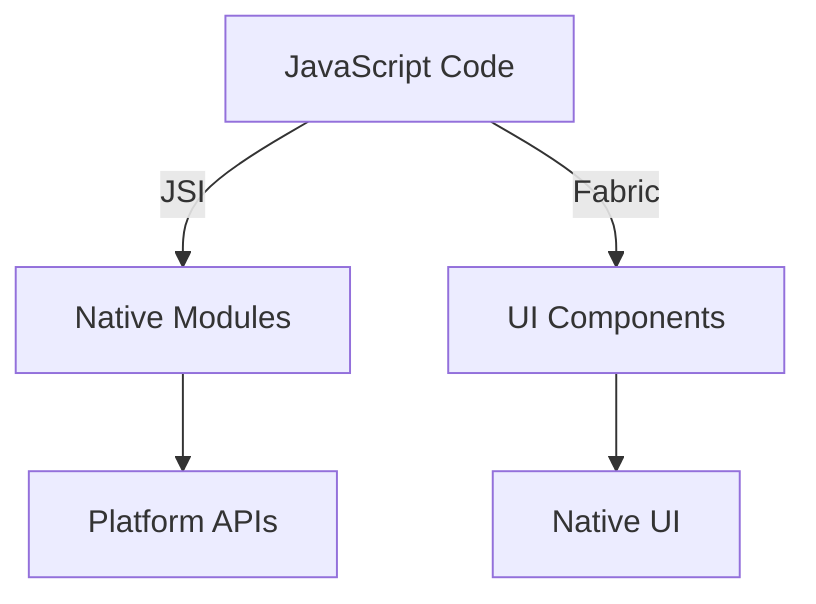

# React Native Architecture Overview

This section provides a comprehensive overview of React Native's internal architecture. While this knowledge isn't mandatory for app developers, understanding these concepts can provide valuable insights into how React Native works under the hood.

## The New Architecture

React Native's new architecture introduces several key components that improve performance and developer experience:

### Core Components

1. **JavaScript Engine (Hermes)**

   - Custom JavaScript engine optimized for React Native
   - Improved start-up time
   - Reduced memory usage
   - Better performance

2. **Bridge Replacement (JSI)**

   - Direct communication between JavaScript and native code
   - Eliminates JSON serialization overhead
   - Enables synchronous operations

3. **Fabric (New Rendering System)**
   - Improved UI performance
   - Better thread management
   - More consistent rendering across platforms

### Architecture Components



## Rendering System (Fabric)

### Overview

Fabric is React Native's new rendering system that provides:

- Improved performance through synchronous operations
- Better thread management
- More consistent rendering across platforms
- Enhanced type safety

### Key Concepts

1. **Shadow Tree**

   ```javascript
   // Example of how React components map to the shadow tree
   <View>
     <Text>Hello</Text>
     <Image source={require('./image.png')} />
   </View>
   ```

2. **Host Components**
   ```cpp
   // Native component definition (C++)
   class ViewComponent : public RNComponent {
     void render() {
       // Platform-specific rendering logic
     }
   }
   ```

### Threading Model

Fabric operates on three main threads:

1. **JavaScript Thread**

   - Runs React's reconciliation
   - Handles business logic
   - Processes events

2. **Shadow Thread**

   - Manages layout calculations
   - Creates and updates the shadow tree
   - Prepares for rendering

3. **Main Thread**
   - Handles UI updates
   - Manages native views
   - Processes user input

## Build System

### Bundled Hermes

Hermes is now the default JavaScript engine:

```json
// android/app/build.gradle
android {
  defaultConfig {
    // Enable Hermes
    enableHermes: true
  }
}
```

```json
// ios/Podfile
use_react_native!(
  :hermes_enabled => true
)
```

### Metro Bundler

Metro handles JavaScript bundling:

```javascript
// metro.config.js
module.exports = {
  transformer: {
    getTransformOptions: async () => ({
      transform: {
        experimentalImportSupport: false,
        inlineRequires: true,
      },
    }),
  },
};
```

## Cross-Platform Implementation

### Native Modules Bridge

```javascript
// JavaScript side
import { NativeModules } from 'react-native';

const { MyNativeModule } = NativeModules;

// Using a native module
MyNativeModule.someMethod()
  .then((result) => console.log(result))
  .catch((error) => console.error(error));
```

```java
// Android (Java/Kotlin)
@ReactModule(name = "MyNativeModule")
public class MyNativeModule extends ReactContextBaseJavaModule {
  @ReactMethod
  public void someMethod(Promise promise) {
    // Native implementation
  }
}
```

```objc
// iOS (Objective-C/Swift)
@interface MyNativeModule : NSObject <RCTBridgeModule>
@end

@implementation MyNativeModule
RCT_EXPORT_MODULE()

RCT_EXPORT_METHOD(someMethod:(RCTPromiseResolveBlock)resolve
                  rejecter:(RCTPromiseRejectBlock)reject)
{
  // Native implementation
}
@end
```

## Performance Optimizations

### View Flattening

View flattening reduces the native view hierarchy:

```javascript
// Before flattening
<View style={styles.container}>
  <View style={styles.wrapper}>
    <Text style={styles.text}>Hello</Text>
  </View>
</View>

// After flattening (internal representation)
<ViewFlattened style={mergedStyles}>
  <Text style={styles.text}>Hello</Text>
</ViewFlattened>
```

### Lazy Loading

```javascript
// Lazy load components
const HeavyComponent = React.lazy(() => import('./HeavyComponent'));

function MyComponent() {
  return (
    <Suspense fallback={<LoadingSpinner />}>
      <HeavyComponent />
    </Suspense>
  );
}
```

## Debugging and Development

### Development Tools

1. **React Native Debugger**

   - Integrated debugging experience
   - Network inspection
   - Redux DevTools integration

2. **Flipper**
   - Native debugging
   - Network inspection
   - Layout inspection
   - Performance monitoring

### Performance Monitoring

```javascript
import { PerformanceObserver } from 'react-native';

const observer = new PerformanceObserver((list) => {
  const entries = list.getEntries();
  entries.forEach((entry) => {
    console.log(`${entry.name}: ${entry.duration}ms`);
  });
});

observer.observe({ entryTypes: ['measure'] });
```

## Best Practices

1. **Memory Management**

   ```javascript
   // Use cleanup in useEffect
   useEffect(() => {
     const subscription = someAPI.subscribe();
     return () => {
       subscription.unsubscribe();
     };
   }, []);
   ```

2. **Native Module Optimization**

   ```javascript
   // Batch native calls
   const batchedUpdates = () => {
     NativeModules.UIManager.batchedUpdates(() => {
       setValue1(newValue1);
       setValue2(newValue2);
     });
   };
   ```

3. **UI Performance**
   ```javascript
   // Use memo for expensive components
   const MemoizedComponent = React.memo(({ data }) => {
     return <ExpensiveRender data={data} />;
   });
   ```

## Migration Guide

### Moving to the New Architecture

1. **Update Dependencies**

   ```json
   {
     "dependencies": {
       "react-native": "^0.70.0"
     }
   }
   ```

2. **Enable New Architecture**

   ```bash
   # For Android
   export RCT_NEW_ARCH_ENABLED=1

   # For iOS
   RCT_NEW_ARCH_ENABLED=1 pod install
   ```

3. **Update Native Modules**

   ```javascript
   // Old architecture
   const MyModule = NativeModules.MyModule;

   // New architecture
   import { TurboModuleRegistry } from 'react-native';
   const MyModule = TurboModuleRegistry.get('MyModule');
   ```

## Further Reading

- [About the New Architecture](/docs/react-native/architecture/new-architecture)
- [Fabric Rendering](/docs/react-native/architecture/fabric)
- [Threading Model](/docs/react-native/architecture/threading)
- [Build Tools](/docs/react-native/architecture/build-tools)
- [Performance](/docs/react-native/architecture/performance)

## Glossary

- **JSI (JavaScript Interface)**: Direct interface between JavaScript and native code
- **Fabric**: New rendering system for React Native
- **TurboModules**: Next-generation native modules
- **Codegen**: Tool for generating native code from JavaScript specifications
- **Hermes**: JavaScript engine optimized for React Native
- **Metro**: JavaScript bundler for React Native
